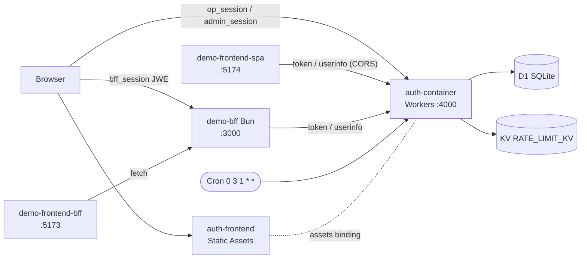
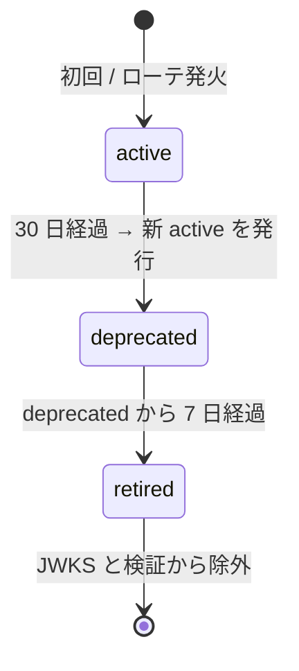

# OIDC Scratch Implementation

OpenID Connect Authorization Code Flow + PKCE をフルスクラッチで実装し、仕様を理解するための学習プロジェクト。
**BFF パターン**と **SPA 直結 (PKCE)** の 2 種類のクライアントから同じ OP を叩くことで、SSO の挙動とセキュリティ責務の違いを比較できる。

- **demo-frontend-bff** (port 5173) → **demo-bff** (Bun) → auth-container
  - confidential client + JWE Cookie ステートレスセッション (`@auth-parts/auth-container-client`)
- **demo-frontend-spa** (port 5174) → 直接 auth-container
  - public client + PKCE / BCP for Browser-Based Apps (`@auth-parts/auth-container-react`)

OP 本体 (auth-container) は Cloudflare Workers + D1、UI は Vite + React SPA + Tailwind v4。
学習目的のスクラッチ実装ながら、PBKDF2 によるパスワード保護・JWT 鍵の月次自動ローテ・KV ベースのレート制限・per-client CORS を備える。

---

## 目次

1. [クイックスタート](#クイックスタート)
2. [動作確認シナリオ](#動作確認シナリオ)
3. [アーキテクチャ](#アーキテクチャ)
4. [BFF と SPA 直結の比較](#bff-と-spa-直結の比較)
5. [技術スタック](#技術スタック)
6. [エンドポイント](#エンドポイント)
7. [セキュリティ実装](#セキュリティ実装)
8. [データモデルとマイグレーション運用](#データモデルとマイグレーション運用)
9. [運用](#運用)
10. [デプロイと CI](#デプロイと-ci)
11. [開発スクリプト](#開発スクリプト)
12. [バージョン](#バージョン)
13. [参照仕様](#参照仕様)

---

## クイックスタート

### 前提

- [Bun](https://bun.sh/) v1.1+
- [pnpm](https://pnpm.io/) v10+
- Node.js 24+ (ライブラリ群の `engines` 要件)
- Wrangler は `pnpm install` で同梱される

### 手順

```bash
# 1. 依存パッケージ
pnpm install

# 2. 各 .env / .dev.vars をコピー
cp packages/auth-container/.dev.vars.example packages/auth-container/.dev.vars
cp packages/demo-bff/.env.example packages/demo-bff/.env
cp packages/demo-frontend-bff/.env.example packages/demo-frontend-bff/.env
cp packages/demo-frontend-spa/.env.example packages/demo-frontend-spa/.env

# 3. demo-bff の JWE Cookie 鍵 (32 byte base64) を生成し COOKIE_KEYS に貼る
openssl rand -base64 32

# 4. ローカル D1 をスキーマ初期化 + シード投入
pnpm db:reset:local   # drizzle/schema.sql を適用 (DROP IF EXISTS → CREATE。既存データは消える)
pnpm db:seed:local    # drizzle/seed.sql で client / 管理者 / テストユーザーを INSERT

# 5. 5 ターミナルで起動
pnpm dev:auth-frontend   # Vite watch ビルド → auth-container/dist-assets
pnpm dev:auth            # Wrangler dev :4000
pnpm dev:bff             # Bun BFF :3000
pnpm dev:frontend-bff    # Vite :5173 (BFF パターン)
pnpm dev:frontend-spa    # Vite :5174 (SPA 直結)
```

> ライブラリ `@auth-parts/auth-container-client` は `ISSUER` を `https://auth-container.hanacus87.net` に固定して埋め込んでいる。
> ローカルの `localhost:4000` を使いたい場合は hosts ファイルや DNS で同ドメインをローカル向けに解決させる運用を採る (ライブラリ側に dev エンドポイントを設けない方針)。

### シード初期値

| 種別          | email                    | password    | 備考                                                                              |
| ------------- | ------------------------ | ----------- | --------------------------------------------------------------------------------- |
| 一般ユーザー  | test@example.com         | password123 | email 確認済み                                                                    |
| 管理者        | admin@example.com        | admin123    | role=`super` (SuperAdmin)                                                         |
| Confidential  | client_id=`bff-app`      | secret あり | redirect_uri=`http://localhost:3000/auth/callback`                                |
| Public (PKCE) | client_id=`frontend-spa` | (none)      | redirect_uri=`http://localhost:5174/callback`、CORS 許可: `http://localhost:5174` |

---

## 動作確認シナリオ

1. `http://localhost:5173` (BFF) → Login → ログイン画面 → 同意 → Dashboard
2. `http://localhost:5174` (SPA 直結) → 起動時に top-level redirect で `/authorize?prompt=none` を試行
   - 1 で既ログインなら一瞬リダイレクトして即 Dashboard (SSO 成立)
   - 未ログインなら `error=login_required` で戻り Login ボタン表示
3. SPA 直結で Login → 通常の `/authorize` → ログイン → 同意 → Dashboard
4. SPA 直結で Logout → `/logout` (RP-Initiated) → 確認画面 → ホームへ
5. `http://localhost:4000/admin/login` で管理画面 (`admin@example.com` / `admin123`) → ユーザー / クライアント / 管理者 / 鍵 の CRUD
6. 新規クライアント作成時、`token_endpoint_auth_method=none` に切り替えると `offline_access` / `refresh_token` チップが表示から消える (UI の整合)
7. DevTools で `bff_session` / `op_session` / `admin_session` が HttpOnly。SPA 直結では `localStorage` / `sessionStorage` に access_token / id_token が **保存されていない** こと
8. SPA 直結でリロード → top-level silent renew でログイン状態が即復元

---

## アーキテクチャ



| サービス          | ポート | 実行環境           | 役割                                                              |
| ----------------- | ------ | ------------------ | ----------------------------------------------------------------- |
| demo-frontend-bff | 5173   | Vite dev           | React SPA (BFF 経由)。トークンをブラウザに一切持たせない          |
| demo-frontend-spa | 5174   | Vite dev           | React SPA (auth-container 直結 / public client + PKCE)            |
| demo-bff          | 3000   | Bun                | BFF。OIDC フロー・JWE セッション・トークン保持 (BFF パターン専用) |
| auth-container    | 4000   | Cloudflare Workers | OP + JSON API + Static Assets (React SPA 配信)                    |
| auth-frontend     | —      | (Static Assets)    | Vite + React SPA。login / consent / register / logout / admin     |
| D1                | —      | Cloudflare         | OP の永続化層 (users / clients / tokens / crypto_keys ...)        |
| KV                | —      | Cloudflare         | レート制限カウンタ (`RATE_LIMIT_KV`)                              |

### ディレクトリ構成

```
oidc-scratch/
├── package.json
├── pnpm-workspace.yaml
├── .github/workflows/deploy.yml     # AuthContainer CI/CD
└── packages/
    ├── auth-container-client/       # BFF 用 OIDC クライアント (confidential)
    ├── auth-container-react/        # SPA 直結用 OIDC React クライアント (PKCE / public)
    ├── auth-container/              # Cloudflare Workers OP 本体
    │   ├── wrangler.toml            # D1 / KV / Cron / Assets
    │   ├── drizzle/
    │   │   ├── schema.sql           # 冪等スキーマ (DROP IF EXISTS → CREATE)
    │   │   └── seed.sql             # 初期 client / admin / user
    │   ├── scripts/gen-seed-hash.ts # PBKDF2 ハッシュ生成 (seed.sql 用)
    │   └── src/
    │       ├── index.ts             # Hono entry + SPA fallback + Cron handler
    │       ├── types.ts             # Bindings / Variables
    │       ├── db/                  # schema.ts (Drizzle) + index.ts
    │       ├── lib/                 # crypto / csrf / email / jwt / key-rotation /
    │       │                        # password (PBKDF2) / pkce / rate-limit /
    │       │                        # safe-equal / session / token-hash / url-policy ...
    │       ├── routes/              # OIDC プロトコル (discovery / jwks / authorize / token / userinfo)
    │       └── api/                 # SPA 向け JSON API (login / consent / logout / register /
    │                                #                   verify-email / reset-password / admin/*)
    ├── auth-frontend/               # Vite + React SPA (ダークテーマ、Tailwind v4)
    │   └── src/
    │       ├── routes.tsx
    │       ├── lib/                 # api.ts / scope-labels.ts
    │       ├── components/          # Button / Input / Alert / Layout / AdminLayout
    │       └── pages/
    │           ├── Login / Register / Consent / Logout / NotFound
    │           └── admin/           # AdminLogin / AdminDashboard / Users / Clients / Admins / Keys
    ├── demo-bff/                    # Bun + Hono。auth-container-client を組み込むだけの薄い実装
    ├── demo-frontend-bff/           # React SPA (BFF パターン)
    └── demo-frontend-spa/           # React SPA (auth-container-react で SPA 直結)
```

---

## BFF と SPA 直結の比較

| 観点                   | BFF パターン (`demo-bff` 経由)                               | SPA 直結 (`demo-frontend-spa`)                    |
| ---------------------- | ------------------------------------------------------------ | ------------------------------------------------- |
| クライアント種別       | confidential (`client_secret_basic`)                         | public (`token_endpoint_auth_method=none`)        |
| トークン保管           | サーバ側 (BFF メモリ)。ブラウザには出さない                  | ブラウザの **JS メモリのみ** (storage 不使用)     |
| ブラウザのセッション   | `bff_session` JWE Cookie (HttpOnly / dir+A256GCM)            | `op_session` (OP 側) のみ。RP に独自 session 無し |
| Refresh Token          | OP が許可 (offline_access scope)                             | **発行禁止** (BCP 212 §6.2 準拠)                  |
| リロード時の再ログイン | Cookie で復元                                                | top-level redirect で `prompt=none` silent renew  |
| RP-Initiated Logout    | Cookie 破棄のみ                                              | `/logout` 経由で OP セッションも切る              |
| Back-Channel Logout    | 非対応 (ステートレス設計上、原理的に成立不可)                | 非対応                                            |
| 想定読者の学習ポイント | サーバ側でトークンを安全に管理する古典的なベストプラクティス | BCP for Browser-Based Apps の現実的な実装例       |

---

## 技術スタック

| 項目                    | 採用技術                                                                            |
| ----------------------- | ----------------------------------------------------------------------------------- |
| auth-container 実行環境 | Cloudflare Workers (compatibility_date `2025-04-01`)                                |
| auth-container DB       | Cloudflare D1 (SQLite)                                                              |
| auth-container UI       | Vite + React 18 + Tailwind v4                                                       |
| BFF 実行環境            | Bun                                                                                 |
| Web フレームワーク      | Hono v4                                                                             |
| フロントエンド          | Vite + React 18                                                                     |
| JWT / JWE               | jose v5                                                                             |
| ORM                     | Drizzle ORM v0.36                                                                   |
| バリデーション          | Zod v4                                                                              |
| パスワードハッシュ      | **PBKDF2-SHA256 / 100,000 iter / Web Crypto API**、列挙対策のタイミング攻撃緩和つき |
| BFF セッション          | JWE Cookie (`dir` + `A256GCM`)。`@auth-parts/auth-container-client` に集約          |
| SPA 直結 OIDC           | Authorization Code + PKCE / メモリ token / top-level silent renew                   |
| メール配信              | Resend HTTP API (`lib/email.ts`)                                                    |
| ライブラリビルド        | tsup (CJS + ESM デュアル出力)                                                       |
| パッケージ管理          | pnpm workspaces                                                                     |

---

## エンドポイント

### OIDC プロトコル (契約不変)

| メソッド  | パス                                | 概要                                              |
| --------- | ----------------------------------- | ------------------------------------------------- |
| GET       | `/.well-known/openid-configuration` | プロバイダメタデータ                              |
| GET       | `/jwks.json`                        | RS256 公開鍵 (JWK Set。retired 鍵は除外)          |
| GET\|POST | `/authorize`                        | 認可エンドポイント                                |
| POST      | `/token`                            | トークン発行 (authorization_code / refresh_token) |
| GET\|POST | `/userinfo`                         | ユーザー情報 (Bearer Token 必須)                  |

### SPA 配信 (Static Assets)

| パス        | 概要                         |
| ----------- | ---------------------------- |
| `/login`    | ログイン画面 (React SPA)     |
| `/register` | 新規登録画面                 |
| `/consent`  | 同意画面                     |
| `/logout`   | ログアウト確認画面           |
| `/admin/*`  | 管理画面 (要 admin ログイン) |

### SPA 向け JSON API

| メソッド | パス                         | 概要                                                              |
| -------- | ---------------------------- | ----------------------------------------------------------------- |
| GET      | `/api/login/context`         | login_challenge 検証                                              |
| POST     | `/api/login`                 | ログイン (→ redirectUrl を JSON で返却)                           |
| GET      | `/api/register/context`      | 登録画面 context                                                  |
| POST     | `/api/register`              | 新規登録 (確認メール送信)                                         |
| POST     | `/api/verify-email`          | メール確認トークン検証                                            |
| POST     | `/api/resend-verification`   | 確認メール再送                                                    |
| POST     | `/api/forgot-password`       | パスワードリセット要求 (メール送信)                               |
| POST     | `/api/reset-password`        | パスワードリセット適用                                            |
| GET      | `/api/consent/context`       | consent_challenge + session_id バインディング検証                 |
| POST     | `/api/consent`               | 同意 / 拒否                                                       |
| GET      | `/api/logout/context`        | ログアウト画面 context + CSRF token                               |
| POST     | `/api/logout`                | ログアウト実行 (CSRF 必須)                                        |
| POST     | `/api/admin/login`           | 管理者ログイン                                                    |
| POST     | `/api/admin/logout`          | 管理者ログアウト (CSRF 必須)                                      |
| GET      | `/api/admin/session`         | 管理者情報 + CSRF token                                           |
| GET/POST | `/api/admin/users`           | 一般ユーザー CRUD (`/:id` / `/:id/delete`、SuperAdmin 専用)       |
| GET/POST | `/api/admin/clients`         | クライアント CRUD (`/:id` / `/:id/delete` / `/:id/rotate-secret`) |
| GET/POST | `/api/admin/admins`          | 管理者 CRUD (`/:id` / `/:id/delete`、SuperAdmin 専用)             |
| POST     | `/api/admin/forgot-password` | 管理者パスワードリセット要求                                      |
| POST     | `/api/admin/reset-password`  | 管理者パスワードリセット適用                                      |
| GET      | `/api/admin/keys`            | JWT 署名鍵一覧 (SuperAdmin 専用)                                  |
| POST     | `/api/admin/keys/rotate`     | 鍵ローテ手動発火 (SuperAdmin 専用)                                |

### demo-bff (`:3000`) — Bun

`@auth-parts/auth-container-client` の Hono アダプタが提供する 3 ルートと、BFF 個別実装の `/api/me` のみ。

| メソッド | パス             | 概要                                                                            |
| -------- | ---------------- | ------------------------------------------------------------------------------- |
| GET      | `/auth/login`    | 302 → `/authorize`。`oauth_pending` JWE Cookie 発行                             |
| GET      | `/auth/callback` | code → token 交換 → id_token 検証 → 302。`bff_session` JWE Cookie を Set-Cookie |
| GET      | `/auth/status`   | `{ loggedIn, user? }` JSON。リフレッシュ時のみ Set-Cookie                       |
| GET      | `/api/me`        | UserInfo プロキシ (401 検知時はセッションクリア)                                |

---

## セキュリティ実装

スクラッチ実装の中心はこの章。各機能はファイルに対応するので、コードと往復しながら読むのが想定。

| 機能               | モジュール                          | 主な適用箇所                                          |
| ------------------ | ----------------------------------- | ----------------------------------------------------- |
| パスワードハッシュ | `src/lib/password.ts`               | `/api/login`, `/api/register`, `/api/admin/login` 等  |
| JWT 鍵自動ローテ   | `src/lib/key-rotation.ts`           | Cloudflare Cron Trigger `0 3 1 * *`                   |
| レート制限         | `src/lib/rate-limit.ts`             | `/api/login` `/api/register` `/api/admin/login` 等    |
| CSRF               | `src/lib/csrf.ts`                   | `/api/logout`, `/api/admin/*` の状態変更系            |
| URL ポリシー       | `src/lib/url-policy.ts`             | redirect_uri / post_logout_redirect_uri / CORS 検証   |
| 安全な等価比較     | `src/lib/safe-equal.ts`             | パスワード検証 / トークン検証                         |
| トークンハッシュ   | `src/lib/token-hash.ts`             | authorization_code / refresh_token を hash で DB 保存 |
| per-client CORS    | `src/lib/url-policy.ts` + Hono cors | public client は admin 画面で必須登録                 |

### パスワードハッシュ

PBKDF2-SHA256 / 100,000 iterations / 16 byte salt / 256 bit 派生鍵。Cloudflare Workers の Web Crypto は `iterations` 上限が 100k のため、OWASP 推奨 (600k) には届かないが Workers 環境上の最大値を採る。

形式: `pbkdf2$<iter>$<salt_b64>$<key_b64>`

`verifyPasswordConstantTime` はユーザーが存在しない場合もキャッシュしたダミーハッシュに対して PBKDF2 を走らせ、応答時間によるユーザー列挙を阻止する。比較は `safe-equal.ts` の constant-time compare。

bcrypt ではなく PBKDF2 を採ったのは Workers の純 Web Crypto 環境を活かすため (依存ゼロ・WASM 不要)。

### JWT 鍵自動ローテーション

`crypto_keys` テーブルで `status: active | deprecated | retired` を管理し、Cron Trigger `0 3 1 * *` (毎月 1 日 03:00 UTC) で `rotateAndRetireKeys` が走る。



- **active**: 新規 ID Token / Access Token の署名に使う
- **deprecated**: 既発行トークンの検証用に JWKS から配信し続ける (グレースピリオド)
- **retired**: JWKS にも検証にも露出しない

グレースピリオド 7 日は ID Token TTL + JWKS `Cache-Control: max-age=3600` に対する十分なマージン。失敗時も次回の Cron 発火で冪等にリカバリされる設計。`POST /api/admin/keys/rotate` で SuperAdmin が手動発火可能 (Cron が無いローカル環境向け)。

### レート制限

`rate-limit.ts` の Hono ミドルウェアが KV namespace `RATE_LIMIT_KV` に Fixed window でカウンタを置く。バケット (`bucket`) + IP (`cf-connecting-ip`) を key とし、超過時は `429 rate_limited` + `Retry-After`。

| バケット      | 上限        | ウィンドウ | 適用               |
| ------------- | ----------- | ---------- | ------------------ |
| `login`       | 10 / window | 15 分      | `/api/login`       |
| `admin-login` | 10 / window | 15 分      | `/api/admin/login` |
| `register`    | 5 / window  | 60 分      | `/api/register`    |

(verify-email / reset-password 系も同様に `rate_limited` を返す。具体値は各ハンドラを参照)。

### CSRF

`csrf.ts` の double-submit cookie。`/api/logout` や `/api/admin/*` の状態変更で必須。`GET /api/admin/session` 等の context 取得 API がトークンを発行し、SPA は次の状態変更リクエストの body に同じ値を載せて投げる。

### URL ポリシー

`url-policy.ts`:

- `redirect_uri` は厳密一致 (フラグメント禁止 / `https` 必須 + `localhost` だけ `http` 許可 / 末尾スラッシュは差分扱い)
- `post_logout_redirect_uri` も同等の厳密一致
- per-client `allowedCorsOrigins` を Hono `cors()` middleware に動的供給。public client は admin 画面で **最低 1 件入力必須**、confidential client は欄が非表示で `[]` 強制 (server-to-server で CORS 不要)

### トークンハッシュ

`token-hash.ts` は `authorization_code` / `refresh_token` を SHA-256 で hash した値だけを DB に保存する。漏洩耐性 (DB 流出時の即時悪用を防ぐ) と `safe-equal` での照合のため。ID Token / Access Token は JWT として stateless 検証なので DB に保存しない。

---

## データモデルとマイグレーション運用

### 主要テーブル (`drizzle/schema.sql`)

| テーブル                                                | 役割                                         |
| ------------------------------------------------------- | -------------------------------------------- |
| `users` / `admins`                                      | 一般ユーザー / 管理者 (PBKDF2 ハッシュ保存)  |
| `clients`                                               | OAuth client (redirect_uris / scopes / CORS) |
| `crypto_keys`                                           | JWT 署名鍵 (active / deprecated / retired)   |
| `authorization_codes`                                   | 認可コード (token-hash で保存)               |
| `access_tokens` / `refresh_tokens`                      | アクセス / リフレッシュトークン (hash)       |
| `op_sessions` / `admin_sessions`                        | OP セッション / 管理画面セッション           |
| `consents`                                              | scope 単位の同意記録                         |
| `email_verification_tokens`                             | メール確認トークン                           |
| `password_reset_tokens` / `admin_password_reset_tokens` | リセットトークン                             |

### `drizzle/schema.sql` 一本主義

連番 migration (`0000_init.sql`, `0001_*.sql` …) ではなく、**`schema.sql` 一本 (DROP IF EXISTS → CREATE) を冪等に流す**運用にしている。

理由:

- 学習プロジェクトであり、本番でもデータ保持の責務を負っていない
- ローカルも本番も `db:reset:remote` / `db:reset:local` で初期化前提
- スキーマ差分管理に Drizzle Kit を導入する複雑度を、現時点では割に合わないと判断

将来データ保持責務を持たせる必要が出たら、Drizzle Kit の `db:generate` で migration を切る運用に切り替える (TODO)。

---

## 運用

### 環境変数

`packages/auth-container/.dev.vars` (ローカル) / Wrangler secrets (本番) に投入する値。

| 変数                | 必須 | 例 / 既定                              | 用途                                                  |
| ------------------- | ---- | -------------------------------------- | ----------------------------------------------------- |
| `SESSION_SECRET`    | yes  | 32 文字以上                            | login_challenge / consent_challenge / op_session 署名 |
| `ENVIRONMENT`       | yes  | `development` / `production`           | Secure Cookie や CSP 等の挙動分岐                     |
| `ISSUER`            | yes  | `http://localhost:4000` (本番は https) | OIDC `iss` クレーム / discovery のベース URL          |
| `ACCESS_TOKEN_TTL`  | yes  | `3600` (秒)                            | Access Token の有効期限                               |
| `ID_TOKEN_TTL`      | yes  | `3600` (秒)                            | ID Token の有効期限                                   |
| `REFRESH_TOKEN_TTL` | yes  | `2592000` (秒 / 30 日)                 | Refresh Token の有効期限                              |
| `RESEND_API_KEY`    | yes  | `re_xxx`                               | Resend API キー (確認メール / リセットメール送信)     |
| `FROM_EMAIL`        | yes  | `noreply@example.com`                  | 上記の差出人。Resend で verified 済みのドメイン必須   |

demo-bff / demo-frontend-\* 側の `.env.example` も併せて参照。

### Cloudflare bindings (`wrangler.toml`)

| binding         | kind          | 用途                                              |
| --------------- | ------------- | ------------------------------------------------- |
| `DB`            | D1            | 永続化層                                          |
| `RATE_LIMIT_KV` | KV namespace  | レート制限カウンタ                                |
| `ASSETS`        | Static Assets | `auth-frontend` の build 成果物 (`./dist-assets`) |
| (Cron)          | Trigger       | `0 3 1 * *` で `rotateAndRetireKeys` を起動       |

### メール送信 (Resend)

`lib/email.ts` から Resend HTTP API を直叩き。失敗時は呼び出し元のハンドラがエラー化を判断する設計。利用箇所:

- 新規登録時の確認メール
- メール確認の再送
- パスワードリセット (一般 / 管理者)
- 管理者招待 (`POST /api/admin/admins` で reset token を兼ねた招待 URL を発行)

`RESEND_API_KEY` が未設定だと送信が失敗するので、ローカル開発でメール系をテストする場合は実 API キー or ダミー fetch を仕込む必要がある。

### 鍵ローテーション手動操作

Cron が無いローカル環境や、緊急時には SuperAdmin の admin 画面から鍵を強制ローテできる:

- `GET /api/admin/keys` — 全鍵の `kid` / `status` / `createdAt` / `deprecatedAt` / `retiredAt` を返す
- `POST /api/admin/keys/rotate` — `rotateAndRetireKeys` を即時起動 (active 経過判定はせず即発火する緊急用)

---

## デプロイと CI

### 初回 (Cloudflare 側のリソース作成)

```bash
# D1
wrangler d1 create auth-container-prod
# → 出力された database_id を packages/auth-container/wrangler.toml に貼る

# KV (レート制限カウンタ)
wrangler kv namespace create auth-container-rate-limit
# → 出力された id を wrangler.toml の [[kv_namespaces]] に貼る

# Secrets
wrangler secret put SESSION_SECRET --config packages/auth-container/wrangler.toml
wrangler secret put RESEND_API_KEY --config packages/auth-container/wrangler.toml
# (FROM_EMAIL / ISSUER / ENVIRONMENT / *_TTL は wrangler.toml の [vars] か Dashboard から)

# 初期スキーマと seed
pnpm --filter auth-container db:reset:remote
pnpm --filter auth-container db:seed:remote
```

### デプロイ (main push で自動)

```bash
pnpm deploy:auth-container   # auth-frontend build → wrangler deploy
```

### スキーマ変更時

`drizzle/schema.sql` を更新し、本番に反映するときは `pnpm --filter auth-container db:reset:remote` で適用する (**本番データが消える** ことを前提)。連番 migration を導入していないため、データ保持が必要なら schema.sql を改めるのではなく `wrangler d1 execute DB --remote --command="ALTER TABLE …"` を手動で叩く運用とする。

### `.github/workflows/deploy.yml`

- **PR**: type-check (`tsc --noEmit`) + auth-frontend build + `wrangler deploy --dry-run`
- **main push**: 同 verify + `wrangler deploy`
- DB migration / seed の自動適用は **行わない**。スキーマ変更は手動で `db:reset:remote` を叩く

必要な GitHub Secrets:

- `CLOUDFLARE_API_TOKEN` (Workers + D1 の書き込み権限)
- `CLOUDFLARE_ACCOUNT_ID`

---

## 開発スクリプト

```bash
# フォーマット
pnpm format
pnpm format:check

# 型チェック
pnpm --filter auth-container exec tsc --noEmit
pnpm --filter auth-frontend  exec tsc -b --noEmit
pnpm --filter @auth-parts/auth-container-client exec tsc --noEmit
pnpm --filter @auth-parts/auth-container-react  exec tsc --noEmit

# DB
pnpm db:reset:local      # schema.sql をローカル D1 に適用
pnpm db:seed:local       # seed.sql をローカル D1 に適用
pnpm db:reset:remote     # 本番 D1 をスキーマ初期化 (データ消失)
pnpm db:seed:remote      # 本番 D1 に seed 投入
pnpm db:generate         # Drizzle Kit (現状は schema.sql 主導なので参考用)

# ライブラリビルド (tsup)
pnpm --filter @auth-parts/auth-container-client build
pnpm --filter @auth-parts/auth-container-react  build
```

---

## バージョン

| パッケージ                          | version |
| ----------------------------------- | ------- |
| ルート (`oidc-scratch`)             | 0.0.1   |
| `auth-container`                    | 0.0.1   |
| `auth-frontend`                     | 0.0.1   |
| `@auth-parts/auth-container-client` | 0.1.0   |
| `@auth-parts/auth-container-react`  | 0.1.0   |
| `@auth-parts/demo-bff`              | 0.0.1   |
| `@auth-parts/demo-frontend-bff`     | 0.0.1   |
| `@auth-parts/demo-frontend-spa`     | 0.0.1   |

現状は RP-Initiated Logout を SPA 直結のみ実装済み。Back-Channel Logout は未実装 (BFF パターンの JWE Cookie ステートレス設計とは原理的に共存しないため、実装する場合は RP 側を stateful 化する必要がある)。

---

## 参照仕様

| 仕様                                                                                                          | 内容                                         |
| ------------------------------------------------------------------------------------------------------------- | -------------------------------------------- |
| [RFC 6749](https://datatracker.ietf.org/doc/html/rfc6749)                                                     | OAuth 2.0 Authorization Framework            |
| [RFC 7636](https://datatracker.ietf.org/doc/html/rfc7636)                                                     | PKCE                                         |
| [RFC 7519](https://datatracker.ietf.org/doc/html/rfc7519)                                                     | JWT                                          |
| [RFC 7517](https://datatracker.ietf.org/doc/html/rfc7517)                                                     | JWK                                          |
| [RFC 6750](https://datatracker.ietf.org/doc/html/rfc6750)                                                     | Bearer Token Usage                           |
| [RFC 9068](https://datatracker.ietf.org/doc/html/rfc9068)                                                     | JWT Profile for OAuth 2.0 Access Tokens      |
| [RFC 9700](https://datatracker.ietf.org/doc/html/rfc9700)                                                     | Best Current Practice for OAuth 2.0 Security |
| [RFC 7591](https://datatracker.ietf.org/doc/html/rfc7591)                                                     | Dynamic Client Registration                  |
| [OIDC Core 1.0](https://openid.net/specs/openid-connect-core-1_0.html)                                        | OpenID Connect Core                          |
| [OIDC Discovery 1.0](https://openid.net/specs/openid-connect-discovery-1_0.html)                              | OpenID Connect Discovery                     |
| [OIDC RP-Initiated Logout](https://openid.net/specs/openid-connect-rpinitiated-1_0.html)                      | RP-Initiated Logout                          |
| [OIDC Back-Channel Logout 1.0](https://openid.net/specs/openid-connect-backchannel-1_0.html)                  | Back-Channel Logout                          |
| [OAuth 2.0 for Browser-Based Apps](https://datatracker.ietf.org/doc/html/draft-ietf-oauth-browser-based-apps) | BCP 212 (BFF パターン推奨)                   |
| [NIST SP 800-132](https://csrc.nist.gov/publications/detail/sp/800-132/final)                                 | PBKDF2 (パスワードベース鍵導出)              |
