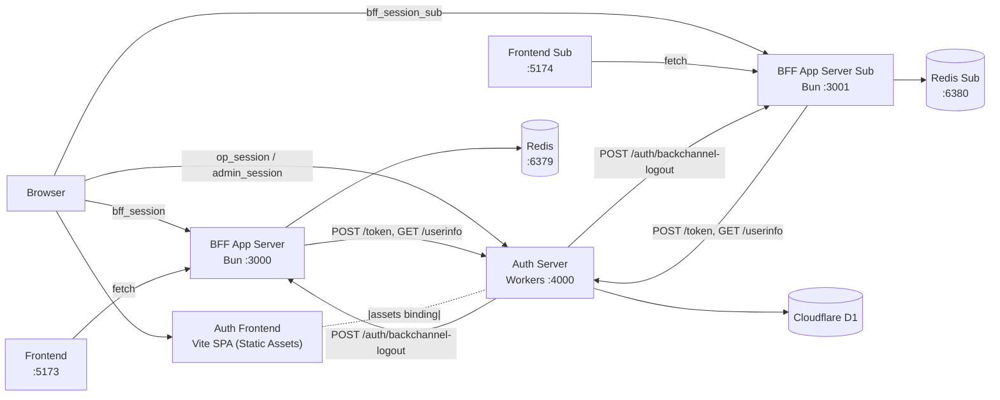

# OIDC Scratch Implementation

OpenID Connect Authorization Code Flow + PKCE をフルスクラッチで実装し、仕様を理解するためのプロジェクト。
BFF (Backend for Frontend) パターンを採用し、トークンをブラウザに一切露出させない構成。
2 つの BFF アプリで SSO (Single Sign-On) と Back-Channel Logout を確認できる。
**Auth Server は Cloudflare Workers + D1 に移行済み**。UI は Vite + React SPA + Tailwind (ダークテーマ)。

## 技術スタック

| 項目                   | 技術                       |
| ---------------------- | -------------------------- |
| AuthContainer 実行環境 | Cloudflare Workers         |
| AuthContainer DB       | Cloudflare D1 (SQLite)     |
| UI (AuthContainer)     | Vite + React + Tailwind v4 |
| BFF 実行環境           | Bun                        |
| Web フレームワーク     | Hono                       |
| フロントエンド         | Vite + React               |
| JWT                    | jose (v5)                  |
| ORM                    | Drizzle ORM                |
| パスワードハッシュ     | bcryptjs                   |
| セッションストア (BFF) | Redis 7 (Docker)           |
| パッケージ管理         | pnpm workspaces            |

## サービス構成



| サービス           | ポート | 実行環境           | 役割                                                           |
| ------------------ | ------ | ------------------ | -------------------------------------------------------------- |
| Frontend           | 5173   | Vite dev           | React SPA。トークンを一切保持しない                            |
| Frontend Sub       | 5174   | Vite dev           | SSO デモ用 SPA (scope: profile なし)                           |
| BFF App Server     | 3000   | Bun                | BFF。OIDC フロー・セッション管理・トークン保持                 |
| BFF App Server Sub | 3001   | Bun                | SSO デモ用 BFF                                                 |
| AuthContainer      | 4000   | Cloudflare Workers | OP + JSON API + Static Assets (React SPA)                      |
| Auth Frontend      | —      | (Static Assets)    | Vite 製 React SPA。login / consent / register / logout / admin |
| D1                 | —      | Cloudflare         | AuthContainer の永続化層 (users, admins, clients, トークン等)  |
| Redis              | 6379   | Docker             | BFF App Server のセッションストア                              |
| Redis Sub          | 6380   | Docker             | BFF App Server Sub のセッションストア                          |

## ディレクトリ構成

```
oidc-scratch/
├── docker-compose.yml               # Redis (BFF 用) のみ
├── package.json
├── pnpm-workspace.yaml
├── .github/workflows/deploy.yml     # AuthContainer CI/CD
└── packages/
    ├── auth-container/              # Cloudflare Workers OP (AuthContainer)
    │   ├── wrangler.toml            # Workers 設定 (D1 / Assets binding)
    │   ├── drizzle/                 # D1 migration + seed.sql
    │   ├── scripts/gen-seed-hash.ts # bcryptjs ハッシュ生成ヘルパ
    │   └── src/
    │       ├── index.ts             # Workers entry (Hono + SPA fallback)
    │       ├── types.ts             # Bindings / Variables
    │       ├── db/
    │       │   ├── schema.ts        # SQLite dialect + JSON mode
    │       │   └── index.ts         # createDb(d1)
    │       ├── lib/                 # jwt / password(bcryptjs) / pkce / session / csrf / ...
    │       ├── routes/              # OIDC プロトコル (discovery / jwks / authorize / token / userinfo)
    │       └── api/                 # SPA 向け JSON API (login / consent / logout / admin/*)
    │
    ├── auth-frontend/               # Vite + React SPA (ダークテーマ)
    │   ├── vite.config.ts           # outDir → auth-container/dist-assets
    │   └── src/
    │       ├── main.tsx
    │       ├── routes.tsx
    │       ├── styles.css           # Tailwind v4 エントリ
    │       ├── lib/                 # api.ts / scope-labels.ts
    │       ├── components/          # Button / Input / Alert / Layout / AdminLayout
    │       └── pages/
    │           ├── Login / Register / Consent / Logout / NotFound
    │           └── admin/           # AdminLogin / AdminDashboard / UsersList / UserForm / ClientsList / ClientForm
    │
    ├── app-server/                  # BFF (Bun)
    │   └── src/                     # /auth, /api/me
    ├── app-server-sub/              # BFF 2 号機
    ├── frontend/                    # React SPA (Vite dev)
    └── frontend-sub/                # React SPA 2 号機
```

## Auth Server エンドポイント

### OIDC プロトコル (契約不変)

| メソッド  | パス                                | 概要                                             |
| --------- | ----------------------------------- | ------------------------------------------------ |
| GET       | `/.well-known/openid-configuration` | プロバイダメタデータ                             |
| GET       | `/jwks.json`                        | RS256 公開鍵 (JWK Set)                           |
| GET\|POST | `/authorize`                        | 認可エンドポイント                               |
| POST      | `/token`                            | トークン発行 (authorization_code, refresh_token) |
| GET\|POST | `/userinfo`                         | ユーザー情報 (Bearer Token 必須)                 |

### SPA 配信 (Static Assets)

| パス        | 概要                         |
| ----------- | ---------------------------- |
| `/login`    | ログイン画面 (React SPA)     |
| `/register` | 新規登録画面                 |
| `/consent`  | 同意画面                     |
| `/logout`   | ログアウト確認画面           |
| `/admin/*`  | 管理画面 (要 admin ログイン) |

### SPA 向け JSON API

| メソッド | パス                    | 概要                                                           |
| -------- | ----------------------- | -------------------------------------------------------------- |
| GET      | `/api/login/context`    | login_challenge 検証                                           |
| POST     | `/api/login`            | ログイン (→ redirectUrl を JSON で返却)                        |
| GET      | `/api/register/context` | 登録画面用 context                                             |
| POST     | `/api/register`         | 新規登録                                                       |
| GET      | `/api/consent/context`  | consent_challenge + session_id バインディング検証              |
| POST     | `/api/consent`          | 同意 / 拒否                                                    |
| GET      | `/api/logout/context`   | ログアウト画面 context + CSRF token                            |
| POST     | `/api/logout`           | ログアウト実行 (CSRF 必須) + BCL 送信                          |
| POST     | `/api/admin/login`      | 管理者ログイン                                                 |
| POST     | `/api/admin/logout`     | 管理者ログアウト (CSRF 必須)                                   |
| GET      | `/api/admin/session`    | 管理者情報 + CSRF token                                        |
| GET/POST | `/api/admin/users`      | ユーザー CRUD (`:id` / `:id/delete`)                           |
| GET/POST | `/api/admin/clients`    | クライアント CRUD (`:id` / `:id/delete` / `:id/rotate-secret`) |

### BFF App Server (:3000 / :3001) — 従来どおり Bun

| メソッド | パス                       | 概要                                                      |
| -------- | -------------------------- | --------------------------------------------------------- |
| GET      | `/auth/login`              | OIDC 認証フロー開始                                       |
| GET      | `/auth/callback`           | 認可コード受信 → トークン交換 → セッション作成 (sid 保存) |
| GET      | `/auth/status`             | ログイン状態確認                                          |
| POST     | `/auth/logout`             | セッション破棄 → OP ログアウト URL 返却                   |
| GET      | `/auth/post-logout`        | OP ログアウト後リダイレクト                               |
| POST     | `/auth/backchannel-logout` | Back-Channel Logout (sid 単位)                            |
| GET      | `/api/me`                  | UserInfo 経由でユーザー情報取得                           |

## セットアップ

### 前提条件

- [Bun](https://bun.sh/) (v1.1+)
- [pnpm](https://pnpm.io/) (v10+)
- [Docker](https://www.docker.com/) (Redis のみ、Postgres は不要)
- [Wrangler](https://developers.cloudflare.com/workers/wrangler/) (AuthContainer 用、`pnpm install` で同梱)

### 手順

```bash
# 1. 依存パッケージ
pnpm install

# 2. BFF / Frontend の .env をコピー
cp packages/app-server/.env.example packages/app-server/.env
cp packages/app-server-sub/.env.example packages/app-server-sub/.env
cp packages/frontend/.env.example packages/frontend/.env
cp packages/frontend-sub/.env.example packages/frontend-sub/.env

# 3. AuthContainer のローカル secret を設定
cp packages/auth-container/.dev.vars.example packages/auth-container/.dev.vars
#   SESSION_SECRET と ENVIRONMENT=development が入る

# 4. Redis (BFF 用) のみ起動 (Postgres は不要)
docker compose up -d

# 5. AuthContainer のローカル D1 を初期化
pnpm db:migrate:local    # drizzle/0000_init.sql を適用
pnpm db:seed:local       # クライアント・テストユーザー・管理者を INSERT

# 6. サーバー起動 (ターミナル 5 枚)
pnpm dev:auth-frontend   # Vite watch ビルド → auth-container/dist-assets
pnpm dev:auth            # Wrangler dev (Workers エミュレータ) :4000
pnpm dev:app             # BFF (Bun) :3000
pnpm dev:app-sub         # BFF Sub :3001
pnpm dev:frontend        # React :5173
pnpm dev:frontend-sub    # React Sub :5174
```

### 本番デプロイ (Cloudflare)

```bash
# 初回のみ
wrangler d1 create auth-container-prod           # 出力された database_id を wrangler.toml に貼る
wrangler secret put SESSION_SECRET --config packages/auth-container/wrangler.toml
wrangler d1 execute DB --remote --file=packages/auth-container/drizzle/seed.sql

# 日常 (main push で GitHub Actions が自動実行)
pnpm deploy:auth-container  # auth-frontend build → wrangler deploy
```

### コード整形・型チェック

```bash
pnpm format
pnpm --filter auth-container exec tsc --noEmit
pnpm --filter auth-frontend exec tsc -b --noEmit
```

## 動作確認

1. `http://localhost:5173` → Login → `http://localhost:4000/login?login_challenge=...` (Vite 製 React ダークテーマ) でログイン → 同意 → Dashboard
2. `http://localhost:5174` → Login → SSO でログイン画面スキップ → Dashboard (email のみ)
3. 一方でログアウト → OP の確認画面 → ログアウトボタン → 両アプリとも BCL で同時ログアウト
4. `http://localhost:4000/admin/login` で管理画面ログイン (admin@example.com / admin123) → ユーザー/クライアント CRUD
5. クライアント新規作成時に `client_id` / `client_secret` が自動生成され、1 度だけ表示される
6. DevTools で `bff_session`, `bff_session_sub`, `op_session`, `admin_session` が HttpOnly であること確認

## CI/CD

`.github/workflows/deploy.yml`:

- PR: type-check + Vite build + wrangler deploy --dry-run
- main push: D1 migration apply + Vite build + wrangler deploy

必要な Secrets:

- `CLOUDFLARE_API_TOKEN` — Workers + D1 の書き込み権限
- `CLOUDFLARE_ACCOUNT_ID`

## 参照仕様

| 仕様                                                                                                          | 内容                                         |
| ------------------------------------------------------------------------------------------------------------- | -------------------------------------------- |
| [RFC 6749](https://datatracker.ietf.org/doc/html/rfc6749)                                                     | OAuth 2.0 Authorization Framework            |
| [RFC 7636](https://datatracker.ietf.org/doc/html/rfc7636)                                                     | PKCE                                         |
| [RFC 7519](https://datatracker.ietf.org/doc/html/rfc7519)                                                     | JWT                                          |
| [RFC 7517](https://datatracker.ietf.org/doc/html/rfc7517)                                                     | JWK                                          |
| [RFC 6750](https://datatracker.ietf.org/doc/html/rfc6750)                                                     | Bearer Token Usage                           |
| [RFC 9068](https://datatracker.ietf.org/doc/html/rfc9068)                                                     | JWT Profile for OAuth 2.0 Access Tokens      |
| [RFC 9700](https://datatracker.ietf.org/doc/html/rfc9700)                                                     | Best Current Practice for OAuth 2.0 Security |
| [RFC 7591](https://datatracker.ietf.org/doc/html/rfc7591)                                                     | Dynamic Client Registration                  |
| [OIDC Core 1.0](https://openid.net/specs/openid-connect-core-1_0.html)                                        | OpenID Connect Core                          |
| [OIDC Discovery 1.0](https://openid.net/specs/openid-connect-discovery-1_0.html)                              | OpenID Connect Discovery                     |
| [OIDC RP-Initiated Logout](https://openid.net/specs/openid-connect-rpinitiated-1_0.html)                      | RP-Initiated Logout                          |
| [OIDC Back-Channel Logout 1.0](https://openid.net/specs/openid-connect-backchannel-1_0.html)                  | Back-Channel Logout                          |
| [OAuth 2.0 for Browser-Based Apps](https://datatracker.ietf.org/doc/html/draft-ietf-oauth-browser-based-apps) | BFF パターン推奨 (BCP 212)                   |
