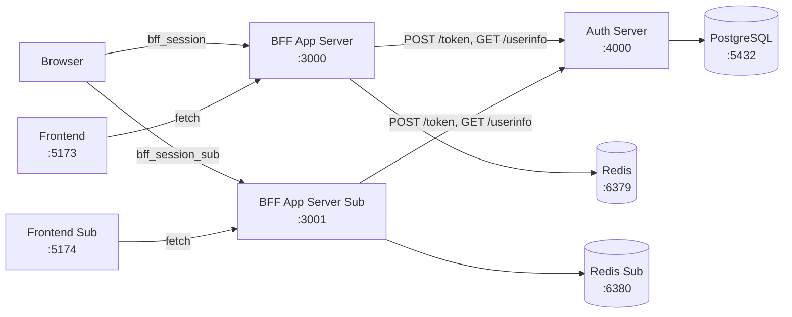
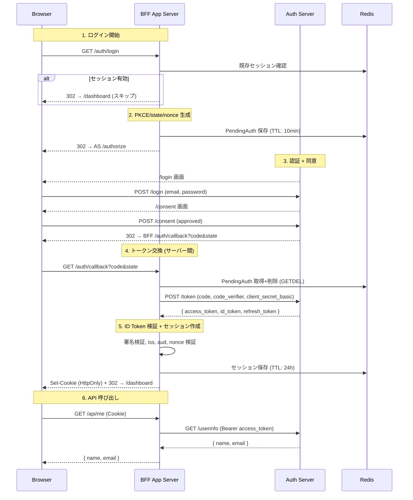
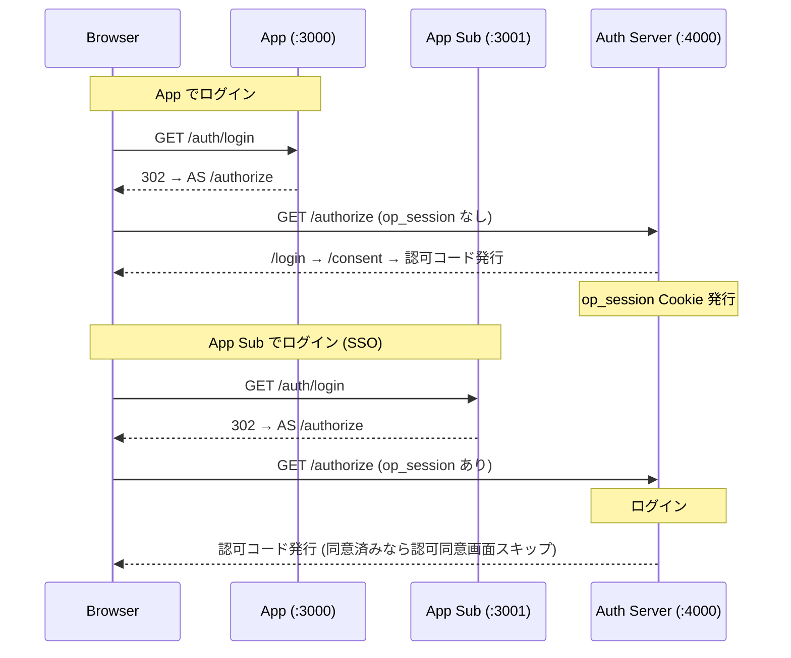
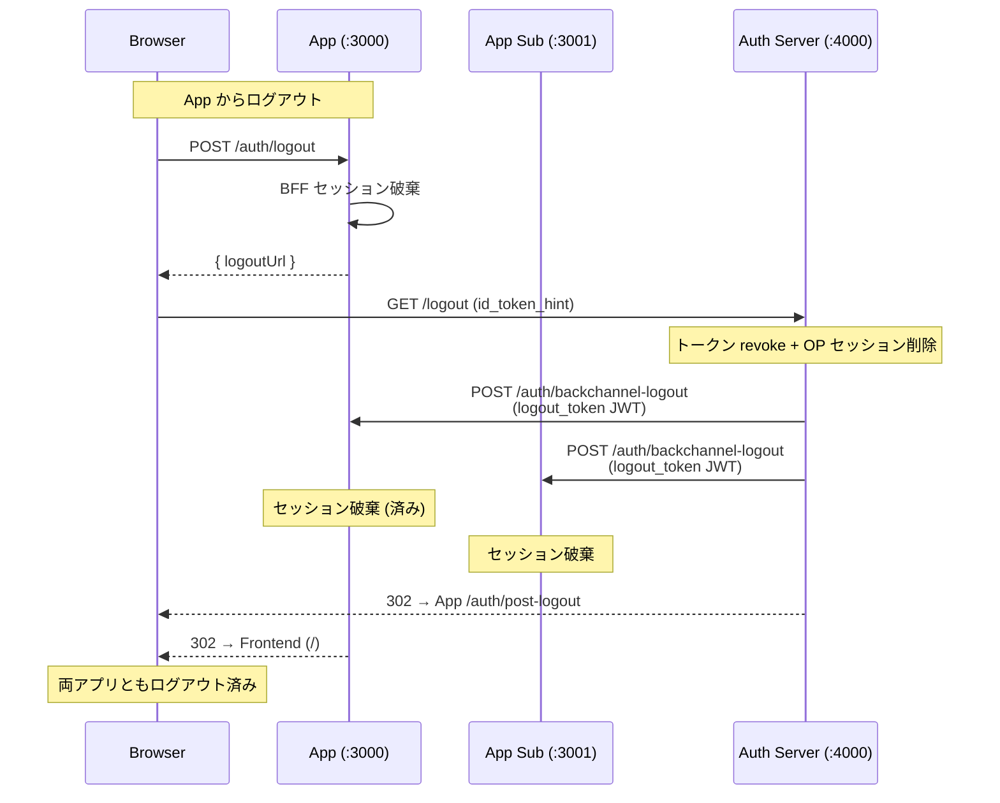

# OIDC Scratch Implementation

OpenID Connect Authorization Code Flow + PKCE をフルスクラッチで実装し、仕様を理解するためのプロジェクト。
BFF (Backend for Frontend) パターンを採用し、トークンをブラウザに一切露出させない構成。
2 つの BFF アプリで SSO (Single Sign-On) を確認できる。

## 技術スタック

| 項目               | 技術                   |
| ------------------ | ---------------------- |
| ランタイム         | Bun                    |
| Web フレームワーク | Hono                   |
| フロントエンド     | Vite + React           |
| JWT                | jose (v5)              |
| ORM                | Drizzle ORM            |
| DB                 | PostgreSQL 16 (Docker) |
| セッションストア   | Redis 7 (Docker)       |
| パッケージ管理     | pnpm workspaces        |

## サービス構成



| サービス           | ポート | 役割                                                |
| ------------------ | ------ | --------------------------------------------------- |
| Frontend           | 5173   | React SPA。トークンを一切保持しない                 |
| Frontend Sub       | 5174   | SSO デモ用 SPA (scope: profile なし)                |
| BFF App Server     | 3000   | BFF。OIDC フロー実行・セッション管理・トークン保持  |
| BFF App Server Sub | 3001   | SSO デモ用 BFF (scope: openid email offline_access) |
| Auth Server        | 4000   | OpenID Provider + ログイン/同意画面 (SSR)           |
| PostgreSQL         | 5432   | ユーザー・クライアント・トークン等の永続化          |
| Redis              | 6379   | BFF App Server のセッションストア                   |
| Redis Sub          | 6380   | BFF App Server Sub のセッションストア               |

## ディレクトリ構成

```
oidc-scratch/
├── docker-compose.yml
├── package.json
├── pnpm-workspace.yaml
└── packages/
    ├── auth-server/                 # OpenID Provider
    │   └── src/
    │       ├── index.ts
    │       ├── db/
    │       │   ├── schema.ts
    │       │   ├── index.ts
    │       │   └── seed.ts
    │       ├── lib/
    │       │   ├── jwt.ts
    │       │   ├── pkce.ts
    │       │   ├── crypto.ts
    │       │   └── session.ts
    │       └── routes/
    │           ├── discovery.ts
    │           ├── jwks.ts
    │           ├── authorize.ts
    │           ├── login.ts
    │           ├── consent.ts
    │           ├── token.ts
    │           ├── userinfo.ts
    │           └── logout.ts
    │
    ├── app-server/                  # BFF App Server
    │   └── src/
    │       ├── index.ts
    │       ├── lib/
    │       │   ├── redis.ts
    │       │   ├── session.ts
    │       │   ├── crypto.ts
    │       │   └── tokens.ts
    │       ├── routes/
    │       │   ├── auth.ts
    │       │   └── api.ts
    │       └── middleware/
    │           └── auth.ts
    │
    ├── app-server-sub/              # BFF App Server Sub (SSO デモ用)
    │   └── src/                     # app-server と同構成。差分:
    │       └── ...                  #   scope に profile なし
    │                                #   Cookie: bff_session_sub
    │                                #   Redis: localhost:6380
    │
    ├── frontend/                    # Frontend SPA
    │   └── src/
    │       ├── main.tsx
    │       ├── App.tsx
    │       ├── pages/
    │       │   ├── Home.tsx
    │       │   ├── Callback.tsx
    │       │   ├── Dashboard.tsx
    │       │   └── NotFound.tsx
    │       └── lib/
    │           ├── oidc.ts
    │           └── api.ts
    │
    └── frontend-sub/                # Frontend Sub (SSO デモ用)
        └── src/                     # frontend と同構成。ポート 5174
            └── ...
```

## エンドポイント一覧

### Auth Server (:4000)

| メソッド  | パス                                | 概要                             |
| --------- | ----------------------------------- | -------------------------------- |
| GET       | `/.well-known/openid-configuration` | プロバイダメタデータ             |
| GET       | `/jwks.json`                        | RS256 公開鍵 (JWK Set)           |
| GET\|POST | `/authorize`                        | 認可エンドポイント               |
| GET\|POST | `/login`                            | ログイン画面・認証処理 (SSR)     |
| GET\|POST | `/consent`                          | スコープ同意画面・同意処理 (SSR) |
| POST      | `/token`                            | トークン発行                     |
| GET       | `/userinfo`                         | ユーザー情報 (Bearer Token 必須) |
| GET\|POST | `/logout`                           | RP-Initiated Logout              |

### BFF App Server (:3000 / :3001)

| メソッド | パス                       | 概要                                                 |
| -------- | -------------------------- | ---------------------------------------------------- |
| GET      | `/auth/login`              | OIDC 認証フロー開始 (既存セッションがあればスキップ) |
| GET      | `/auth/callback`           | 認可コード受信 → トークン交換 → セッション作成       |
| GET      | `/auth/status`             | ログイン状態確認                                     |
| POST     | `/auth/logout`             | セッション破棄 → OP ログアウト URL 返却              |
| GET      | `/auth/post-logout`        | OP ログアウト後リダイレクト                          |
| POST     | `/auth/backchannel-logout` | Back-Channel Logout (Auth Server からの通知受信)     |
| GET      | `/api/me`                  | UserInfo エンドポイント経由でユーザー情報取得        |

## 認証フロー (BFF パターン)



## SSO フロー

Auth Server の OP セッション Cookie (`op_session`) が共有されるため、一方でログインすればもう一方ではログイン画面がスキップされる。



|                | App (:5173)                         | App Sub (:5174)             |
| -------------- | ----------------------------------- | --------------------------- |
| scope          | openid profile email offline_access | openid email offline_access |
| Dashboard 表示 | name + email                        | email のみ                  |
| Cookie 名      | bff_session                         | bff_session_sub             |
| Redis          | :6379                               | :6380                       |

## SSO ログアウトフロー (Back-Channel Logout)

OIDC Back-Channel Logout 1.0 を実装。一方のアプリからログアウトすると、Auth Server が全 BFF に `logout_token` (JWT) を POST し、各 BFF のセッションが即座に破棄される。



## セキュリティ

| 観点                           | 実装                                                    |
| ------------------------------ | ------------------------------------------------------- |
| トークン保存場所               | Redis サーバー側のみ。ブラウザにトークンなし            |
| セッション Cookie              | HttpOnly, SameSite=Lax, Secure (本番)                   |
| クライアント認証               | Confidential Client (client_secret_basic) + PKCE (S256) |
| CSRF 防止                      | SameSite=Lax Cookie + state パラメータ                  |
| Replay 防止                    | nonce パラメータ (ID Token 検証時に照合)                |
| state 二重使用防止             | Redis GETDEL (アトミック取得+削除)                      |
| Refresh Token Rotation         | 毎回のリフレッシュで旧トークン revoke + 新トークン発行  |
| 認可コード再利用検知           | 再利用時に当該ユーザーの全トークンを revoke             |
| id_token_hint 検証             | ログアウト時に JWT 署名検証 (期限切れ許容)              |
| タイミング攻撃防止             | ユーザー未存在時もダミーハッシュでパスワード検証実行    |
| クライアント認証の定数時間比較 | crypto.timingSafeEqual による secret 比較               |
| Back-Channel Logout            | ログアウト時に全 BFF へ logout_token を POST            |
| セッション ID エントロピー     | 256 bit (crypto.getRandomValues)                        |

## セットアップ

### 前提条件

- [Bun](https://bun.sh/) (v1.1+)
- [pnpm](https://pnpm.io/) (v10+)
- [Docker](https://www.docker.com/)

### 手順

```bash
# 1. 依存パッケージをインストール
pnpm install

# 2. 環境変数ファイルをコピー
cp packages/auth-server/.env.example packages/auth-server/.env
cp packages/app-server/.env.example packages/app-server/.env
cp packages/app-server-sub/.env.example packages/app-server-sub/.env
cp packages/frontend/.env.example packages/frontend/.env
cp packages/frontend-sub/.env.example packages/frontend-sub/.env

# 3. PostgreSQL + Redis を起動
docker compose up -d

# 4. DB スキーマを反映
pnpm db:push

# 5. テストデータを投入
pnpm db:seed
#    => クライアント: bff-app / bff-sub
#    => ユーザー: test@example.com / password123

# 6. サーバーを起動（それぞれ別ターミナル、または VSCode の All Servers で一括起動）
pnpm dev:auth          # Auth Server      → http://localhost:4000
pnpm dev:app           # App Server       → http://localhost:3000
pnpm dev:app-sub       # App Server Sub   → http://localhost:3001
pnpm dev:frontend      # Frontend         → http://localhost:5173
pnpm dev:frontend-sub  # Frontend Sub     → http://localhost:5174
```

### 動作確認

1. http://localhost:5173 にアクセス → **Login** → ログイン → 同意 (初回のみ) → Dashboard (name + email)
2. http://localhost:5174 にアクセス → **Login** → **ログインスキップ (SSO)** → 同意 (初回のみ) → Dashboard (email のみ)
3. DevTools > Cookies に `bff_session` / `bff_session_sub` / `op_session` が HttpOnly で存在することを確認

## 参照仕様

| 仕様                                                                                                          | 内容                               |
| ------------------------------------------------------------------------------------------------------------- | ---------------------------------- |
| [RFC 6749](https://datatracker.ietf.org/doc/html/rfc6749)                                                     | OAuth 2.0 Authorization Framework  |
| [RFC 7636](https://datatracker.ietf.org/doc/html/rfc7636)                                                     | PKCE (Proof Key for Code Exchange) |
| [RFC 7519](https://datatracker.ietf.org/doc/html/rfc7519)                                                     | JWT (JSON Web Token)               |
| [RFC 7517](https://datatracker.ietf.org/doc/html/rfc7517)                                                     | JWK (JSON Web Key)                 |
| [RFC 6750](https://datatracker.ietf.org/doc/html/rfc6750)                                                     | Bearer Token Usage                 |
| [OIDC Core 1.0](https://openid.net/specs/openid-connect-core-1_0.html)                                        | OpenID Connect Core                |
| [OIDC Discovery 1.0](https://openid.net/specs/openid-connect-discovery-1_0.html)                              | OpenID Connect Discovery           |
| [OIDC RP-Initiated Logout](https://openid.net/specs/openid-connect-rpinitiated-1_0.html)                      | RP-Initiated Logout                |
| [OIDC Back-Channel Logout 1.0](https://openid.net/specs/openid-connect-backchannel-1_0.html)                  | Back-Channel Logout                |
| [OAuth 2.0 for Browser-Based Apps](https://datatracker.ietf.org/doc/html/draft-ietf-oauth-browser-based-apps) | BFF パターン推奨 (BCP 212)         |
